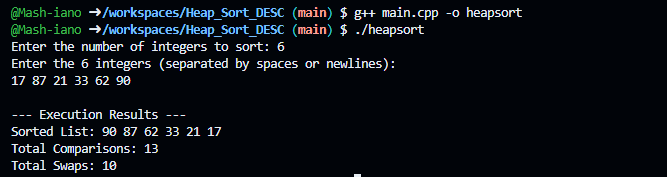

# Heapsort Algorithm (Descending Order)
BY:Ian Macharia          EB3/67249/23
## 1. The goal?
The mission for this project was to build a manual sorting engine in C++ that can take any list of numbers even massive ones up to 1.78 million and sort them in **descending order**. 

To keep things logical and satisfy the assignment, I didn't use any built in libraries like `std::sort`. Instead, I implemented a **Heapsort** algorithm from scratch using dynamic memory (raw pointers) so the program stays fast and efficient without crashing my computer's memory.

## 2. The Logic: How I Built It
To get the numbers to sort from largest to smallest, I used a **Min-Heap** strategy.

* **The Build:** First, I turn the list into a Min-Heap. In this structure, the smallest number is always sitting at the very top (the root).
* **The Swap:** I take that smallest number from the top and swap it with the number at the very end of the list. Now, the smallest number is locked at the back.
* **The Sift:** Since the new number at the top is likely not the smallest anymore, I sift it down the tree until the next smallest value bubbles up to the root.
* **The Result:** By the time I’ve moved every smallest number to the back, the front of the list is naturally left with the largest numbers.

## 3. A Simple Walkthrough
If you gave my code the numbers `[10, 5, 8]`, here is the thought process:

1.  **Heapify:** It sees 5 is the smallest and moves it to the front. `[5, 10, 8]`
2.  **Swap:** It swaps 5 with the last number (8). `[8, 10 | 5]` (5 is now locked).
3.  **Fix:** It looks at 8 and 10. 8 is smaller, so it stays put.
4.  **Final Swap:** It swaps 8 with 10. `[10 | 8, 5]`
5.  **Done:** The list is now `[10, 8, 5]`. Perfect descending order.

## 4. Efficiency

* **Speed ($O(n \log n)$):** Whether the list is already sorted, totally random, or completely reversed, Heapsort takes about the same amount of time. It’s incredibly stable and won't suddenly slow down on big data.
* **Memory ($O(1)$):** This is the best part. The algorithm is in place, meaning it sorts the numbers inside their original array. It doesn't need to make extra copies of the 1.78 million items, which saves a ton of RAM

## 5. My Test Results
I ran several stress tests to see how the code handles different scales. Here is what I found:

| Scale (n)          | Comparisons | Swaps | time
| **Small (10)**     | 35         | 20   | Instant. 
| **Medium (9,999)** | 280k       | 140k | Finished in about 2ms
| **Large (89,786)** | 3 Million  | 1.5 Million |Finished in 16ms
| **Huge (1.78M)**   | 75 Million | 38 Million | Took about 0.3second

## 6. How to Run It
1.  **Compile and Run:** Use a C++ compiler and run the main.cpp in this project

g++ main.cpp -o heapsort
./heapsort

2.  **Input:** Tell the program how many numbers you have, then feed them in. 
